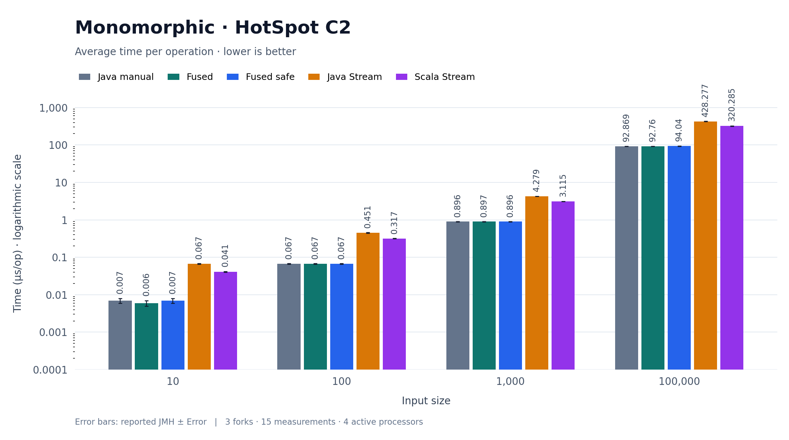
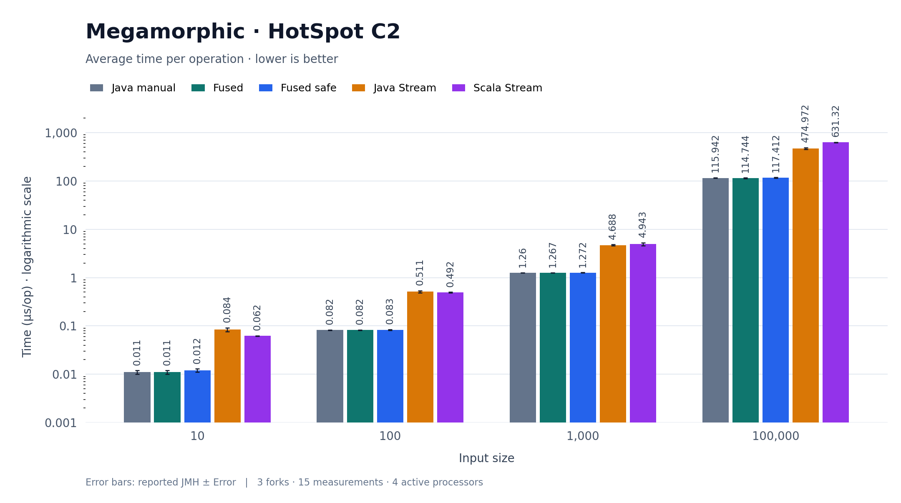
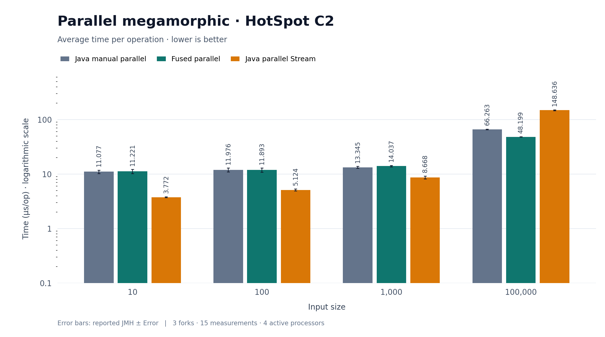

# Stream Fusion

[](https://jitpack.io/#leorm2002/stream-fusion)
[](https://www.scala-lang.org)
[](https://opensource.org/licenses/Apache-2.0)

A zero-allocation, compile-time stream fusion library for Scala 3.

`stream-fusion` uses Scala 3 macros (Quotes & Reflection) to fuse high-level declarative stream pipelines—such as `.map`, `.filter`, `.flatMap`, `.skip`, and `.limit`—directly into a single, compact, imperative `while` loop at compile time. It eliminates intermediate iterators, wrappers, and boxed objects, delivering raw performance on par with handwritten Java loops.

---

## Installation (JitPack)

You can import `stream-fusion` directly from GitHub using **JitPack**.

### 1. In `build.sbt`

Add the JitPack resolver and library dependency to your `build.sbt`:

```scala
resolvers += "jitpack" at "https://jitpack.io"

// Core compile-time stream fusion engine
libraryDependencies += "com.github.leorm2002" % "stream-fusion" % "0.1.0"
```

### 2. Local Development (from Source)

To build and publish to your local repository without JitPack:

```sh
git clone https://github.com/leorm2002/stream-fusion.git
cd stream-fusion
sbt publishLocal
```

### Requirements
- **Scala Version:** **3.8.4** or higher 

---

## Quick Start & Imports

Import `FusedStream` and its extension methods / intrinsic collectors:

```scala
import fuse.FusedStream.* 
```

---

## Examples

### 1. Sequential Pipeline

```scala
import fuse.FusedStream.*

val sum: Double = FusedStream
  .from(numbers)
  .filter(_ % 2 == 0)
  .map(_.toDouble * 1.5)
  .collect(summing)

println(s"Result: $sum")
```

### 2. Multi-threaded Parallel Pipeline
Parallel execution partitions indexed collections across worker threads with dynamic work chunking:

```scala
import fuse.FusedStream.*

val total: Long = FusedStream
  .from(numbers)
  .parallel()
  .filter(_ > 500_000)
  .map(_.toLong * 2L)
  .collect(summing)
```

### 3. FlatMap (1:N Transformations)

```scala
import fuse.FusedStream.*

val words = Array("hello", "stream", "fusion")

val letters: List[Char] = FusedStream
  .from(words)
  .flatMap(w => FusedStream.from(w.toCharArray).limit(3))
  .collect(toList)
```

---

## Configurations

`stream-fusion` provides two configuration layers: compile-time options (`CompileConfig`) and runtime settings  (`RuntimeConfig`).

### 1. Compile-Time Configuration (`CompileConfig`)

`CompileConfig` controls the code generation performed by the macro. Instances must be provided as `inline given` values with literal booleans:

| Option | Type | Default | Description |
| :--- | :--- | :--- | :--- |
| `useUnsafe` | `Boolean` | `true` | Enables `VarHandle` direct access to `java.util.ArrayList` internal array, eliminating bounds checks. Requires JVM flag `--add-opens java.base/java.util=ALL-UNNAMED`. |
| `enableLogging` | `Boolean` | `false` | Prints compiler debug logs and the generated imperative Scala AST during compilation. |
| `strictInlining` | `Boolean` | `true` | Requires custom collectors to be concrete classes with `inline` methods to prevent runtime overhead. |

#### Example: Overriding `CompileConfig`
```scala
import fuse.FusedStream.*

inline given CompileConfig = CompileConfig(
  useUnsafe = true,        // Maximize ArrayList throughput (requires --add-opens)
  enableLogging = true,    // Inspect the generated while-loop code at compile time
  strictInlining = true    // Enforce zero-allocation collectors
)

val result = FusedStream.from(myArrayList).map(_ * 2).collect(summing)
```

---

### 2. Runtime Configuration (`RuntimeConfig`)

| Parameter | Type | Default | Description |
| :--- | :--- | :--- | :--- |
| `ec` | `ExecutionContext` | `ExecutionContext.global` | The execution context executing the chunked tasks. |
| `workerCount` | `Int` | `availableProcessors()` | Number of logical worker threads. Must be `> 0`. |
| `chunksPerWorker` | `Int` | `8` | Chunk overpartitioning factor for dynamic load balancing. Must be `> 0`. |

#### Example: Overriding `RuntimeConfig`
```scala
import fuse.FusedStream.*
import java.util.concurrent.Executors
import scala.concurrent.ExecutionContext

// Create a custom dedicated thread pool
val customPool = Executors.newFixedThreadPool(4)
val customEc = ExecutionContext.fromExecutor(customPool)

// Supply the custom runtime configuration
given RuntimeConfig = RuntimeConfig(
  ec = customEc,
  workerCount = 4,
  chunksPerWorker = 16 // 4 workers * 16 = 64 chunks for fine-grained work stealing
)

```

---

## Collectors

### Built-in Collectors
- `summing`: Specialised primitive accumulator (supports `Int`, `Long`, `Float`, `Double`) with zero boxing.
- `toArray`: Direct copy into a preallocated array for exact and upper-bound sizes.
- `toList`: Accumulates into a Scala immutable `List`.
- `toSet`: Collects into a Scala `Set`.
- `findFirst`: Return the first element, if present.

### Custom Collectors

Implement `Collector` for custom aggregations:, for parallel pipelines, implement `ParallelCollector` (requiring thread-safe or partitionable buffers and an associative `combine` method).
Examples can be found in the reference usage repository [Fused Stream — Reference Usage](https://github.com/leorm2002/sf-integration)

## Reference Usage

A minimal integration project demonstrating built-in and custom collectors, including `ToMapCollector` and `MinMaxCollector`, with sequential and parallel execution examples.

See [Fused Stream — Reference Usage](https://github.com/leorm2002/sf-integration) for practical examples of library usage and extensibility.


## Benchmarks (HotSpot C2)

Results measured with `-XX:TieredStopAtLevel=4` (tiered compilation up to C2). **Lower is better.**

- **Run date:** 2026-10-06 01:19:12
- **JMH configuration:** 3 forks, 5 × 2 s warmup iterations, 5 × 2 s measurement iterations (15 measurements per result).
- **JVM configuration:** `-Xms8g -Xmx8g -XX:ActiveProcessorCount=4`.

Each chart groups implementations by input size. The vertical axis shows average time in **µs/op on a logarithmic scale** so that all input sizes remain readable. Bar heights show the reported scores; error bars show the reported JMH `± Error` values. Exact values are available below each chart. Tier 0 and Tier 1 results are omitted here.

### Monomorphic



<details>
<summary>Exact results (µs/op, score ± error)</summary>

| Input size | Java manual | Fused | Fused safe | Java Stream | Scala Stream |
| ---: | ---: | ---: | ---: | ---: | ---: |
| 10 | 0.007 ± 0.001 | 0.006 ± 0.001 | 0.007 ± 0.001 | 0.067 ± 0.001 | 0.041 ± 0.001 |
| 100 | 0.067 ± 0.001 | 0.067 ± 0.001 | 0.067 ± 0.001 | 0.451 ± 0.007 | 0.317 ± 0.005 |
| 1,000 | 0.896 ± 0.002 | 0.897 ± 0.002 | 0.896 ± 0.001 | 4.279 ± 0.007 | 3.115 ± 0.023 |
| 100,000 | 92.869 ± 0.257 | 92.760 ± 0.224 | 94.040 ± 1.072 | 428.277 ± 1.573 | 320.285 ± 4.191 |

</details>

### Megamorphic



<details>
<summary>Exact results (µs/op, score ± error)</summary>

| Input size | Java manual | Fused | Fused safe | Java Stream | Scala Stream |
| ---: | ---: | ---: | ---: | ---: | ---: |
| 10 | 0.011 ± 0.001 | 0.011 ± 0.001 | 0.012 ± 0.001 | 0.084 ± 0.008 | 0.062 ± 0.001 |
| 100 | 0.082 ± 0.001 | 0.082 ± 0.001 | 0.083 ± 0.002 | 0.511 ± 0.026 | 0.492 ± 0.011 |
| 1,000 | 1.260 ± 0.003 | 1.267 ± 0.004 | 1.272 ± 0.010 | 4.688 ± 0.141 | 4.943 ± 0.337 |
| 100,000 | 115.942 ± 1.505 | 114.744 ± 2.171 | 117.412 ± 1.863 | 474.972 ± 17.787 | 631.320 ± 4.161 |

</details>

### Parallel megamorphic



<details>
<summary>Exact results (µs/op, score ± error)</summary>

| Input size | Java manual parallel | Fused parallel | Java parallel Stream |
| ---: | ---: | ---: | ---: |
| 10 | 11.077 ± 0.780 | 11.221 ± 0.969 | 3.772 ± 0.051 |
| 100 | 11.976 ± 0.951 | 11.893 ± 1.009 | 5.124 ± 0.220 |
| 1,000 | 13.345 ± 0.505 | 14.037 ± 0.455 | 8.668 ± 0.516 |
| 100,000 | 66.263 ± 0.770 | 48.199 ± 0.318 | 148.636 ± 3.138 |

</details>


## License

This project is licensed under the [Apache License, Version 2.0](LICENSE).

---